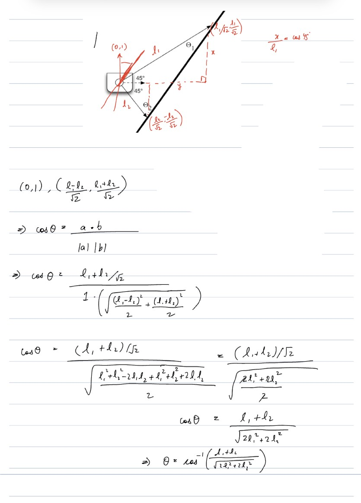

# Warmup Project

## Description

The objective of this project was to acquire a foundational grasp of ROS (Robot Operating System), explore the utilization of sensor data for real-time adjustments to robot behavior, and gain proficiency in diagnosing issues/debugging in the ROS platform.

## Robot Behavior

### Drive in a Square

#### Behavior

Drives the robot in a 1m x 1m square. We solved the challenge using time based control borrowed from the `Teleop` node. Since we already had functions to move the neato a desired distance and be able to make turns, it was relatively straightforward to make it move in a square using a for loop.

#### Implementation

1. Node Initialization:

    - The DrawSquareNode class is defined, which inherits from the Node class provided by ROS.
    - In the constructor (`__init__`), the node is given the name 'send_message_node'.
    - A timer is created to call the run_loop function at a rate of 10 times per second (10 Hz).
    - A publisher (self.vel_publisher) is created to publish messages of type Twist to the `cmd_vel` topic. This topic is used to control the velocity of a robot.
    - A boolean flag self.square_done is initialized to False.

2. Run Loop (run_loop):

    - The run_loop function is called by the timer at 10 Hz.
    - It checks if self.square_done is False.
    - If not, it enters a loop that repeats four times, effectively instructing the robot to move forward and turn left to form a square.
    - It prints messages indicating that the robot is driving forward and turning left.
    - The drive_forward and turn_left_deg functions are called to control the robot's movements.

3. Drive Functions:

    - drive(self, linear_vel, angular_vel): This function creates a Twist message with linear and angular velocity values and publishes it to control the robot's motion.
    - turn_left_deg(self, angular_vel, degrees): This function makes the robot turn left by setting angular velocity and calculating the time needed for the turn based on the desired angle in degrees.
    - drive_forward(self, linear_vel, distance): This function makes the robot move forward by setting linear velocity and calculating the time needed to cover the desired distance.

4. Main Function (main):

    - The main function is the entry point of the script.
    - It initializes ROS using rclpy.init().
    - Creates an instance of the DrawSquareNode.
    - Enters the ROS spin loop to keep the node running until it's ready to shutdown.
    - Once finished, it cleans up the node and shuts down ROS gracefully.

Tried to check angle 135 and 45 first and make them equal distance to try and follow the wall. Then realized that I need to do math to actually make the angles 45. Use trig or smth.

Drive square tried first with timed driving and turns. Added random sleep times first 1, 0.5s. Then realized need to do math for turning time. Then realized exact math not ideal since it takes
some time to accelerate. Then added random constant about 0.09 to account for that. Better solution could be used. Teleop was pretty easy to implement. Have a goal to make it record key holds and do video game like driving mechanics.

## Obstacle Avoidance

#### Behavior

The Obstacle Avoider node enables the robot to autonomously navigate while avoiding obstacles. The robot moves forward until it detects an obstacle within a certain range. Upon detection, the robot halts, pivots in place, and then proceeds in the direction that offers the most open space.

#### Implementation

1. Run Loop (`run_loop`):

    - The primary logic resides here. The robot's behavior is primarily dictated by a series of flags that keep track of its current state (e.g., avoiding, turning).
    - Laser scan data is continuously analyzed to check for obstacles. When an obstacle is detected, the robot is programmed to turn either left or right based on the available space. 
    
2. Dynamic Avoidance (`avoid`):

    - This function begins the avoidance process, and is passed the direction that the robot will be avoiding the obstacle.
    
3. Movement Functions:

    - `drive` and `turn_degrees` functions control the robot's linear and angular movements.
    - These functions are versatile, allowing for varying speeds and turn angles, providing the robot with a good range of motion.

## Person Follower

#### Behavior

The Person Follower node allows the robot to track and follow a person based on lidar data. The robot continuously updates its distance via P-control (of PID fame) and angle relative to the person and adjusts its path to maintain a certain distance.

#### Implementation

1. Run Loop (`run_loop`):

    - Here, the robot employs a simple proportional control strategy to manage its speed and turning radius based on the detected distance and angle to the person.
    - The robot will stop if it loses track of the person.
    
2. Data Processing (`get_lidar_coords` and `on_scan`):

    - These functions process the raw lidar data to extract meaningful information.
    - The `on_scan` function calculates the centroid of the lidar points and updates the robot's internal state regarding the person's position.

3. Movement Function (`drive`):

    - This function is responsible for the robot's linear and angular movement, and it's called within the main loop to adjust the robot's path dynamically.

## Wall Follower

#### Behavior

The Wall Follower node is designed to have the robot follow along a wall at a consistent distance. It uses lidar scan data to get into an optimal distance and angle relative to the wall.

#### Implementation

1. Run Loop (`run_loop`):

    - This is the core of the wall-following logic. The robot's behavior is determined by interpreting lidar scan data and odom readings.
    - In the bang-bang implementation, depending on the distances detected on the sides and front of the robot, it adjusts its speed and turning radius to maintain a consistent distance from the wall.

2. Other implementation of Run Loop (`run_loop2`):

    - This is an alternative implementation of the wall-following logic. 
    - It uses trigonometry to calculate the angle between the robot and the wall and makes a precise alignment before moving forward.

3. Turning and Driving (`turn_left_deg` and `drive_forward`):

    - These functions control the robot's angular and linear movements.
    - They are more simplified than in other nodes but serve the purpose of wall following well.

#### Math for the implementation of Run Loop 2

## Teleop

#### Behavior

The teleop node allows the user to control the robot using the keyboard. The robot can be moved forward, backward, and rotated left and right. The robot will continue to move in the direction of the last key pressed until another key is pressed. The robot will stop moving when the emergency stop key is pressed. Since we started with implementing this node, the main challenge was to get familiar with moving the neato. Our first approach was to simply publish to the `cmd_vel` topic and sleep for a fixed duration. 

#### Implementation

1. Run Loop (`run_loop`):

    - This loop captures keyboard inputs in real-time and maps them to specific movements of the robot.
    - The robot responds almost instantly to keyboard inputs, offering a smooth control experience.
    
2. Movement Function (`drive`):

    - As in other nodes, this function manages the robot's movement by publishing Twist messages based on the input received.
    - The function is called within the main loop to adjust the robot's path dynamically based on the operator's commands.

3. Child nodes

    - To bring two functions together, we decided to allow teleop to start and stop our other drive nodes.
    - It uses the `subprocess` module to run `ros2` with the module

